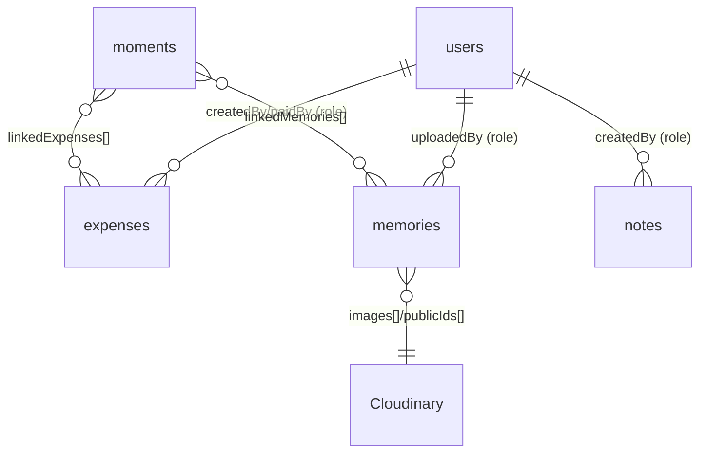

# FIREBASE BIBLE

> The Firestore data model: initialisation, every collection's schema, queries, sync, offline
> behaviour, and the all-important security-rules dependency. Field names verified from the
> actual `.set()/.add()/.update()` calls in code.

Related: [STATE_MANAGEMENT](./STATE_MANAGEMENT.md) · [SECURITY_REVIEW](./SECURITY_REVIEW.md) · [MEDIA_SYSTEM](./MEDIA_SYSTEM.md)

---

## 1. Initialisation (`firebase.js`)

- Config object at `firebase.js:2-9` (project `usual-9c5d4`). The Firebase **web config is public
  by design** — it is not a secret; access control is the job of Firestore **Security Rules**.
- `initializeFirebase()` (`firebase.js:21`) runs once at login: `initializeApp`, `firestore()`,
  `enablePersistence({ synchronizeTabs: true })` (graceful warnings on `failed-precondition`/
  `unimplemented`), then assigns collection refs and sets `firebaseInitialized = true`.
- Cached refs: `usersCollection`, `expensesCollection`, `memoriesCollection`, `notesCollection`,
  `budgetCollection`, `momentsCollection` (`firebase.js:38-43`). The **`secret_notes`** and
  **`moods`** collections are accessed inline via `firebase.firestore().collection(...)` rather
  than a cached ref (minor inconsistency, harmless).
- **No Firebase Authentication** is used — login is the local PIN check (`auth.js`). This is the
  central security fact; see [SECURITY_REVIEW](./SECURITY_REVIEW.md).

---

## 2. Collections & schemas

> Roles are `krishna` / `rashi` (the two users). Timestamps are Firestore server timestamps
> unless noted.

### `users` — doc id = user id (`imsusu` / `imgugu`)
| Field | Type | Notes | Source |
|-------|------|-------|--------|
| `uid` | string | the user id | `auth.js:62-76` |
| `name` | string | "Susu"/"Gugu" | |
| `role` | string | `krishna`/`rashi` | |
| `lastSeenUs` | Timestamp | updated when the user opens the Us tab | `auth.js:88-98` |

### `expenses` — auto id
| Field | Type | Notes |
|-------|------|-------|
| `amount` | number | total |
| `paidBy` | string | role who paid |
| `shares` | object | `{krishna, rashi}` split amounts |
| `category` | string | food/dates/gmasti/gifts/home/regret/misc |
| `note` | string | optional |
| `countTowardsBudget` | boolean | excludes from budget when false |
| `expenseDate` | Timestamp | the date the spend happened |
| `createdAt` | Timestamp | write time |
| `createdBy` | string | role |
| `isSettlement` | boolean | present on settle-up records | 
Source: `expenses.js` (`add`/`update`/`delete`, settle at `:272-332`).

### `memories` — auto id
| Field | Type | Notes |
|-------|------|-------|
| `images` | string[] | Cloudinary `secure_url`s |
| `mediaTypes` | string[] | per item: `image`/`video`/`audio` |
| `publicIds` | string[] | Cloudinary public ids (for deletion) |
| `caption` | string | optional |
| `memoryDate` | Timestamp | the memory's date |
| `uploadedBy` | string | role |
| `imagePosition` | object | `{x,y}` 0–100% for framing |
| `imageZoom` | number | 1.0–2.5 |
| `createdAt` | Timestamp | write time |
Source: `memories.js:294-360`, position update `:560-582`.

### `notes` — auto id (limit 20, newest first)
| Field | Type |
|-------|------|
| `text` | string |
| `createdBy` | string (role) |
| `createdAt` | Timestamp |
Source: `notes.js:5-58`.

### `secret_notes` — auto id (inline collection ref)
| Field | Type | Notes |
|-------|------|-------|
| `title` | string | shown while locked |
| `content` | string | revealed after `unlockDate` |
| `unlockDate` | Timestamp | unlock moment |
| `createdBy` | string (role) | |
| `createdAt` | Timestamp | |
Source: `notes.js:112-204`. Lock/unlock is a **client-side date comparison** (not enforced
server-side) — fine for two trusted users; noted in [SECURITY_REVIEW](./SECURITY_REVIEW.md).

### `budget` — doc id = `current` (singleton)
| Field | Type | Notes |
|-------|------|-------|
| `amount` | number | monthly limit |
| `month` | number | 0-indexed month it applies to |
| `year` | number | |
| `createdAt` | Timestamp | |
Source: `budget.js:5-112`. On a new month the doc is deleted and re-prompted (`budget.js:13-16`).

### `moods` — doc id = `YYYY-MM-DD` (inline ref, `{merge:true}`)
| Field | Type | Notes |
|-------|------|-------|
| `<role>` | string | e.g. `krishna: "happy"` |
| `<role>_time` | Timestamp | per-person time |
| `timestamp` | Timestamp | last write |
Source: `mood.js:5-90`. Per-day doc with separate per-role fields → no overwrite between users.

### `moments` — auto id
| Field | Type | Notes |
|-------|------|-------|
| `title` | string | |
| `date` | Timestamp | |
| `type` | string | date/trip/anniversary/movie/dinner/outing/special/other |
| `notes` | string | optional |
| `linkedExpenses` | string[] | soft links to expense ids |
| `linkedMemories` | string[] | soft links to memory ids |
| `mood` | string\|null | optional |
| `createdAt` | Timestamp | |
| `createdBy` | string (role) | |
Source: `moments.js:23-66`.

---

## 3. Relationships (soft, id-based)

All links are **soft** (arrays of ids resolved in-memory, e.g. `getLinkedExpensesData`,
`moments.js:128`). There are no transactions or referential-integrity guarantees — deleting an
expense referenced by a moment leaves a dangling id, which the lookups simply skip. Acceptable for
this app; noted in [TECHNICAL_DEBT](./TECHNICAL_DEBT.md).

---

## 4. Reads, writes, indexes

- **Queries used:** `expenses.orderBy('createdAt','desc')`; `memories.orderBy('memoryDate','desc')`;
  `notes.orderBy('createdAt','desc').limit(20)`; `secret_notes.orderBy('unlockDate','asc')`;
  `moments.orderBy('date','asc')`; single-doc gets for `budget/current`, `moods/{date}`, `users/{id}`.
- **Indexes:** all queries are single-field `orderBy`, which Firestore serves with automatic
  single-field indexes — **no composite index is required** *(verified by the absence of
  `where`+`orderBy` combinations; speculative only in that the Firestore console isn't in-repo).*
- Filtering (paid-by, month, search, upcoming/past moments) is done **in memory**, not via queries
  — simplest approach at two-user data volumes.

## 5. Sync & offline
- **No live listeners** (`onSnapshot`): data refreshes on explicit `load*()` after writes or on
  tab actions. The other person's changes appear on next load, not in real time. Intentional.
- **Offline persistence** caches reads and queues writes; the app stays usable offline and syncs
  when reconnected. See [STATE_MANAGEMENT §5](./STATE_MANAGEMENT.md#5-firestore-sync--offline).

## 6. Failure handling
- `initializeFirebase` wraps init in try/catch and logs; persistence errors are warned, not fatal.
- Each `load*()`/write is wrapped with try/catch + a `showError` toast in its module.

## 7. Security rules dependency (important)
The **Firestore security rules are NOT in this repository.** Because there is no Firebase Auth,
the only thing standing between the public web config and the data is whatever rules are set in the
Firebase console. **Action item:** export the live rules into the repo (e.g. `firestore.rules`)
so they are version-controlled and reviewable. See [SECURITY_REVIEW](./SECURITY_REVIEW.md) for the
recommended posture (a shared-secret/allowlist approach proportional to a two-user app).

## 8. Migration considerations (future)
- Schema is loosely typed; adding a field is safe (older docs simply lack it — readers default).
- If ever moving off Firestore, the load/render separation makes the data layer swappable behind
  the `load*()`/collection-ref functions.
- A future "real-time" upgrade would swap `load*()` for `onSnapshot` per collection without
  touching render functions — but only if the live-update feeling is worth the added complexity.

---

### Related documents
[STATE_MANAGEMENT](./STATE_MANAGEMENT.md) · [SECURITY_REVIEW](./SECURITY_REVIEW.md) · [MEDIA_SYSTEM](./MEDIA_SYSTEM.md) · [KNOWN_LIMITATIONS](./KNOWN_LIMITATIONS.md)
