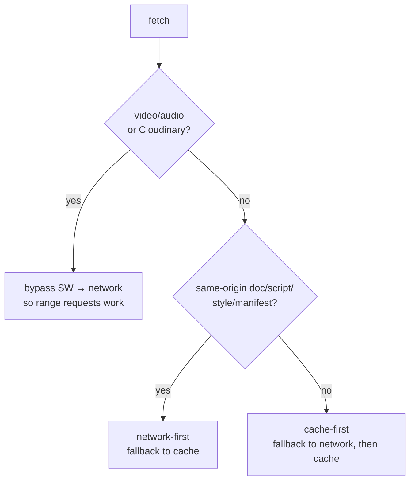
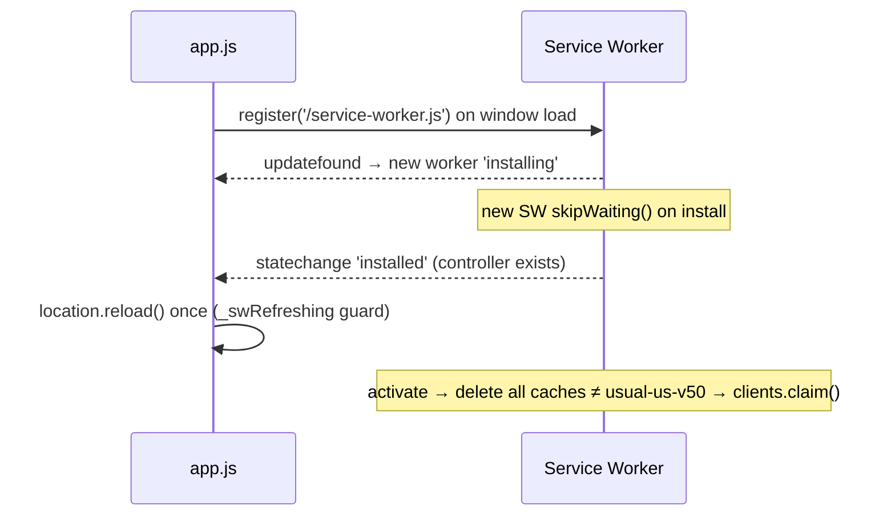

# PWA BIBLE

> The Progressive Web App layer: manifest, service worker, caching/offline, install, update flow,
> Android hardening, and Vercel deployment. Verified against `manifest.json`,
> `service-worker.js`, `vercel.json`, and `js/app.js`.

Related: [REPOSITORY_ARCHITECTURE](./REPOSITORY_ARCHITECTURE.md) · [DEBUGGING_GUIDE](./DEBUGGING_GUIDE.md) · [DEVELOPMENT](./DEVELOPMENT.md)

`usual us` is installed and used as a standalone PWA on Android. It was previously wrapped as a
Trusted Web Activity (TWA) Android app and hosted on Netlify — **both are now legacy and removed**
(see [CHANGELOG](./CHANGELOG.md)). It is a pure PWA on Vercel.

---

## 1. Manifest (`manifest.json`)

| Field | Value |
|-------|-------|
| `name` / `short_name` | "usual us" |
| `display` | `standalone` (no browser chrome) |
| `theme_color` / `background_color` | `#0a0a0a` |
| `orientation` | `portrait` |
| `start_url` / `scope` / `id` | `/` |
| `icons` | `icon-192.svg?v=3`, `icon-512.svg?v=3` (any), `icon-192/512.png?v=2` (any), `icon-512.png` (maskable) |
| `screenshots` | four narrow PWA install screenshots |

The SVG icons are the developer's own artwork; they were optimised (embedded raster downscaled)
from ~4.7 MB each to ~0.47 MB — see [CHANGELOG](./CHANGELOG.md). The `?v=` query is the cache-buster.

---

## 2. Service worker (`service-worker.js`, cache `usual-us-v50`)

### Precache (install)
On `install`, `urlsToCache` (the app shell: `/`, `index.html`, `styles.css`, `firebase.js`, the
`lib/` libraries, every `js/` module, `manifest.json`, the app icons, all `icons/` SVGs, and the
sound effects) is added to the cache, then `skipWaiting()`.

### Fetch strategy

- **Network-first** for navigation, scripts, styles, manifest → users never get a stale app.
- **Cache-first** for images/fonts → fast, offline-friendly.
- **Bypass** for video/audio and `res.cloudinary.com` → preserves HTTP range requests (seeking)
  on mobile. Do **not** cache these.

### Update flow

Because an installed PWA can't be manually refreshed, `app.js` auto-reloads **once** when a new
worker takes control. On `activate`, every non-current cache is deleted (so bumping `CACHE_NAME`
fully clears the old version).

> **Golden rule:** whenever you change any cached asset, **bump `CACHE_NAME`**
> (`service-worker.js:1`, currently `usual-us-v50`). This is the #1 cause of "I don't see my
> change" — see [DEBUGGING_GUIDE](./DEBUGGING_GUIDE.md).

---

## 3. Offline support
- App shell + icons + sounds are precached, so the UI loads offline.
- Firestore offline persistence (`firebase.js:27`) serves cached data and queues writes.
- Media (Cloudinary) is **not** cached, so previously-unseen photos/videos won't load offline —
  an accepted trade-off (see [KNOWN_LIMITATIONS](./KNOWN_LIMITATIONS.md)).

## 4. Install flow
- Android Chrome: menu → "Add to Home screen" / "Install app" → standalone icon.
- iOS Safari: Share → "Add to Home Screen".
- After install, updates arrive automatically via the service-worker update flow above.
  (User-facing steps live in [DEVELOPMENT](./DEVELOPMENT.md).)

## 5. Standalone & Android hardening (`js/app.js`)
To feel like a native app rather than a browser tab:
- `history.scrollRestoration = 'manual'` and a seeded history stack so the **back button closes
  the top overlay** instead of leaving the app (`pushBackState`, `closeTopOverlay`).
- **Edge-swipe blocking:** document-level touch listeners detect a horizontal gesture starting in
  the 30px screen-edge zone and block Chrome's back/forward overscroll — but **only** when there's
  no horizontal scroll on the target, and **never inside the Us tab** (so native scroll always
  wins). `touchstart/end` are passive; only the edge `touchmove` is non-passive. This is the one
  sanctioned `preventDefault`-on-touch in the codebase.

## 6. Deployment {#deployment}
- **Host:** Vercel, connected to the GitHub repo. **Push → auto deploy** (preview deploys for
  branches, production for the main branch). Live at usualus.vercel.app.
- **CRITICAL — no build step.** The app runs from the **loose repo files** (classic `<script>`
  tags, `service-worker.js`, `manifest.json` at root), not a bundle. `vercel.json` therefore sets
  `"framework": null`, `"buildCommand": ""`, `"outputDirectory": "."` so Vercel serves the **repo
  root verbatim** (exactly as Netlify's old `publish = "."` did). **Do not** let Vercel auto-detect
  Vite and serve `dist/` — `vite build` does not copy the loose JS/SW/manifest into `dist/`, so a
  `dist`-served deploy 404s the scripts and service worker (stuck splash + "shortcut, not Install").
  `npm run build` still works locally; it just isn't used for deployment.
- **`vercel.json` headers:** `Cache-Control: no-cache` for `/service-worker.js` and `/manifest.json` (so
  updates reach phones immediately) + global security headers (`X-Frame-Options: DENY`,
  `X-Content-Type-Options: nosniff`, `Referrer-Policy: strict-origin-when-cross-origin`).
- There is **no `netlify.toml`** (removed) — Vercel ignores it anyway. Don't reintroduce
  Netlify/TWA artifacts.

## 7. Known limitations & future native migration
- No `prefers-reduced-motion` (animation-heavy) — see [KNOWN_LIMITATIONS](./KNOWN_LIMITATIONS.md).
- Media isn't available offline.
- **If a native app is ever wanted again:** the cleanest path is re-wrapping the PWA as a TWA
  (Bubblewrap/PWABuilder) — the manifest + service worker already satisfy installability. This
  would re-introduce `assetlinks.json` and a package id; document it then. Not currently planned.

---

### Related documents
[REPOSITORY_ARCHITECTURE](./REPOSITORY_ARCHITECTURE.md) · [DEBUGGING_GUIDE](./DEBUGGING_GUIDE.md) · [DEVELOPMENT](./DEVELOPMENT.md) · [CHANGELOG](./CHANGELOG.md)
