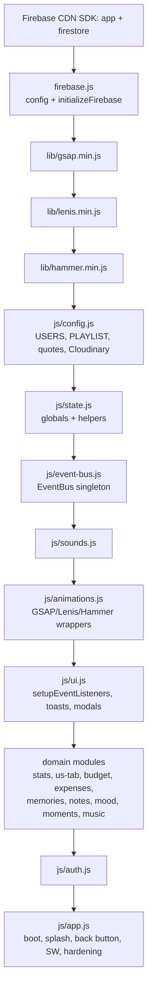
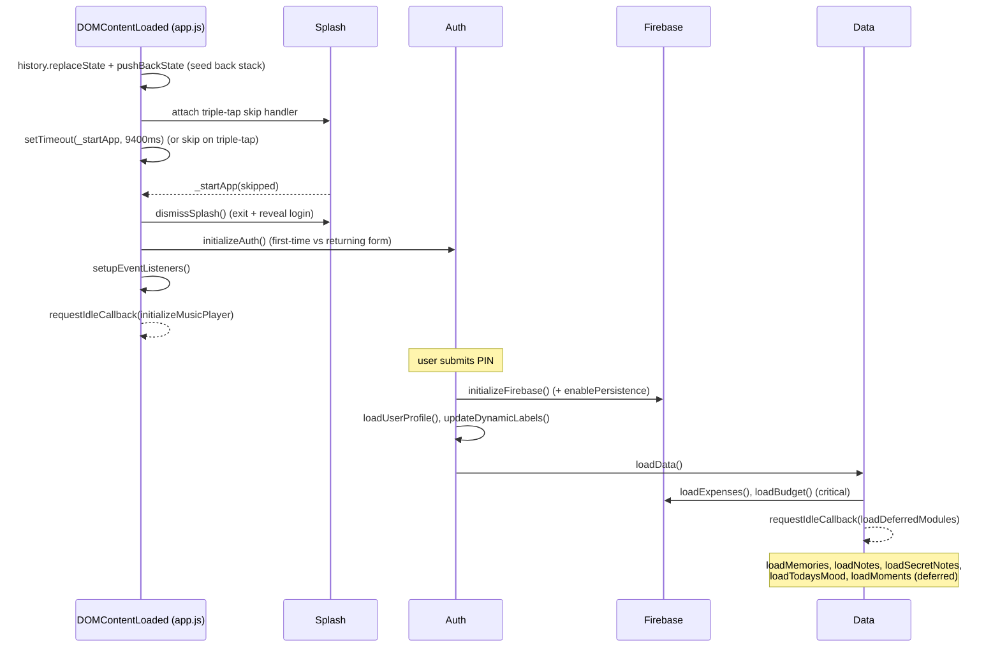
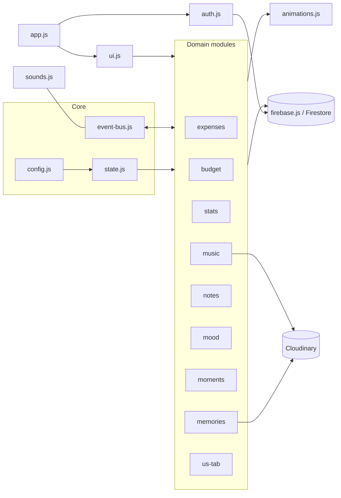

# REPOSITORY ARCHITECTURE

> How the code is laid out, how it boots, and how the pieces talk to each other.

Related: [PROJECT_BIBLE](./PROJECT_BIBLE.md) · [STATE_MANAGEMENT](./STATE_MANAGEMENT.md) · [PWA_BIBLE](./PWA_BIBLE.md) · [PERFORMANCE_BIBLE](./PERFORMANCE_BIBLE.md)

---

## 1. Directory & file map

```
usual-us/
├── index.html            Single entry point: every screen, every modal, ordered <script> tags
├── styles.css            One global stylesheet (~5,400 lines): themes, components, animations
├── firebase.js           Firebase config, initializeFirebase(), Firestore collection refs
├── service-worker.js     PWA precache list + fetch strategy (cache name: usual-us-v50)
├── manifest.json         PWA manifest (name, icons, theme, screenshots, standalone)
├── vercel.json           Hosting headers: no-cache for SW/manifest + security headers
├── vite.config.js        Dev server (port 5000) + build (outDir: dist)
├── package.json          Scripts + devDeps (vite, eslint, prettier, svgo) + deps (gsap, lenis, hammerjs)
├── eslint.config.js      Lint rules; .prettierrc — format rules
├── icon-192.svg/.png     App icons (optimised; see CHANGELOG)
├── icon-512.svg/.png
├── js/                   Application logic (see §3)
├── lib/                  Local copies: gsap.min.js, lenis.min.js, hammer.min.js
├── icons/                Category, mood, tab and decorative SVG icons (optimised)
├── sounds/               MP3 sound effects
├── screenshots/          PWA install screenshots
└── docs/                 This engineering Bible
```

There is **no `src/` and no bundler graph** in the authored code. Vite is used for the dev
server and an optional production build, but the app runs directly from these files.

---

## 2. Script load order

`index.html` ends with a deliberate, ordered list of `<script>` tags. **Order matters** —
files share a global namespace and later files depend on earlier ones.



**Why this order:** config/state/event-bus must exist before any module uses them;
`animations.js` and `ui.js` provide helpers the domain modules call; `app.js` is last because
it orchestrates everything on `DOMContentLoaded`.

Styles: a single `styles.css` plus Google Fonts (`Playfair Display`, `Homemade Apple`, `Inter`).

---

## 3. The `js/` modules

### Core (cross-cutting)
| File | Responsibility | Key references |
|------|----------------|----------------|
| `config.js` | Constants: Cloudinary creds, `USERS`, `RELATIONSHIP_START`, `PLAYLIST` (15 songs), `DAILY_QUOTES`, `categoryEmojis`, `moodEmojis` | `js/config.js:5-82` |
| `state.js` | All global mutable state + helpers (`getDaysTogether`, `getDailyQuote`, `getPartnerName`, `getPartnerRole`, `getExpenseDate`, `isLateNight`, `escapeHTML`, `debounce`) | `js/state.js` |
| `event-bus.js` | Zero-dependency pub/sub singleton `EventBus` (`on/once/off/emit/clear`) | `js/event-bus.js:8-86` |
| `app.js` | Lifecycle: splash, boot sequence, history/back-button, service-worker updates, Android/PWA gesture hardening, `window.*` exports for inline handlers | `js/app.js` |

### UI & motion
| File | Responsibility | Key references |
|------|----------------|----------------|
| `ui.js` | `setupEventListeners()` (all bindings), toasts (`showError`/`showSuccess`), `showLoading`, login flow, modal backdrop close, easter egg, balance celebration | `js/ui.js:5-431` |
| `animations.js` | GSAP wrappers (`animateModalIn/Out`, `animateTabSwitch`, `animateCardsIn`, `animateEntrance`), Lenis init (`initSmoothScroll`), Hammer pan for image-adjust | `js/animations.js` |
| `sounds.js` | `SoundFX` singleton; preloads 6 MP3s; plays on EventBus events | `js/sounds.js:5-60` |

### Domain modules
| File | Responsibility | Key references |
|------|----------------|----------------|
| `expenses.js` | Expense CRUD, balance calc (`calculateCurrentBalance`, cached), settle flow, rendering, filters | `js/expenses.js` |
| `budget.js` | Monthly budget load/reset/progress | `js/budget.js:5-148` |
| `stats.js` | Monthly category breakdown, SVG pie chart, 6-month trend bars | `js/stats.js:5-162` |
| `memories.js` | Photo/video/audio upload (Cloudinary), preview, image-adjust, timeline render, viewers, lazy video | `js/memories.js` |
| `notes.js` | Sticky notes (long-press delete) + time-locked secret notes | `js/notes.js` |
| `mood.js` | Daily mood set/load, partner mood display | `js/mood.js:5-104` |
| `moments.js` | Moments calendar (dates/trips/anniversaries), full view, create/edit | `js/moments.js` |
| `music.js` | Playlist render, playback, seek, recently-played, fade-in autoplay | `js/music.js` |
| `us-tab.js` | Tab switching, Us-tab lifecycle, milestones, highlights, particles, late-night theme | `js/us-tab.js` |
| `auth.js` | PIN login, user profile, dynamic labels, last-seen | `js/auth.js:5-144` |

---

## 4. Application lifecycle & initialization order



**Splash timing constants** (`js/app.js:10-15`): display 9400 ms, exit 1000 ms, skip 400 ms,
reveal 300 ms, skip-reveal 100 ms, triple-tap window 700 ms.

**Service worker** is registered on `window load` (`js/app.js`), with an
`updatefound`→`statechange` listener that auto-reloads once when a new worker takes control
(important for an installed PWA where the user can't manually refresh).

---

## 5. Dependency graph (who calls what)



Key decoupling points:
- **`EventBus`** lets `budget`/`stats` react to `expenses:loaded`, `sounds` react to all
  domain events, and `auth`/`mood`/`moments`/`stats` react to `tab:switched` — without direct
  calls. Full catalog in [STATE_MANAGEMENT](./STATE_MANAGEMENT.md#event-catalog).
- **Global functions** are the interface between files (e.g. `loadExpenses`, `switchTab`,
  `renderMemoriesTimeline`). Functions used from inline HTML handlers are explicitly attached to
  `window` in `app.js`, `memories.js`, `notes.js`, `moments.js`, `music.js`.

---

## 6. Rendering flow

The pattern everywhere: **Firestore → in-memory array → render function → DOM.**

1. A `load*()` function queries Firestore and fills a global array (`expenses`, `memories`,
   `notes`, `secretNotes`, `moments`, `budget`, `currentMood`).
2. A `render*()` function builds HTML from that array and writes it to a container
   (often via `innerHTML`), then runs entrance animations (`animateCardsIn`).
3. After any write, the relevant `load*()` is called again to refresh array + DOM.

Cheap-render guards avoid redundant work: `_cachedBalance` (`js/expenses.js:523`),
`_lastMilestonesDay` (`js/us-tab.js:35`), `_lastMomentsHash` (`js/moments.js:205`).
See [PERFORMANCE_BIBLE](./PERFORMANCE_BIBLE.md).

---

## 7. Navigation & tab system

- Five tabs: `home`, `add`, `history`, `stats`, `us` (bottom nav `.nav-item[data-tab]`,
  `index.html:412-433`).
- `switchTab(tabName)` (`js/us-tab.js:59`) is the single entry point. It:
  emits `tab:switched`; cancels pending music timers; cross-fades via `animateTabSwitch`
  (out 0.18 s → swap `.active` classes → in 0.3 s); toggles the music toggle visibility
  (Us-only); applies `us-active`/`late-night` body classes; manages music autoplay; and calls
  `initializeUsTab()` when entering Us.
- **The Us tab is hidden until earned.** `revealUsTab()` (`js/us-tab.js:171`) adds `.revealed`
  to the Us nav item on the first visit to the stats tab, persisted in `sessionStorage`.

## 8. Modal system

- All modals live in `index.html` and are shown/hidden by toggling the `hidden` class.
- Opening animates the content in via `animateModalIn()`; clicking the backdrop (target ===
  modal) closes it (`js/ui.js:91-102`).
- The **back button** closes the top-most overlay via `closeTopOverlay()` (`js/app.js:146`),
  in priority order: image-adjust modal → registered modals in `MODAL_IDS` → music panel →
  non-home tab. This makes Android back behave natively. Full modal catalog in
  [UI_UX_BIBLE](./UI_UX_BIBLE.md).

## 9. Event system

`EventBus` (`js/event-bus.js`) — synchronous, in-registration-order, error-isolated pub/sub.
See the full event catalog and listeners in
[STATE_MANAGEMENT](./STATE_MANAGEMENT.md#event-catalog).

## 10. Storage system

- **Firestore** — the source of truth (collections in §11 of [FIREBASE_BIBLE](./FIREBASE_BIBLE.md)).
- **localStorage** — `usual_us_user_id` (remembered login, `auth.js`), `usual_us_mood`
  (today's mood, `mood.js`), `recentlyPlayed` (song indices, `music.js`).
- **sessionStorage** — Us-tab "revealed" flag (`us-tab.js`).

## 11. Firebase interaction

`initializeFirebase()` (`firebase.js:21`) runs once at login: `initializeApp`, `firestore()`,
`enablePersistence({ synchronizeTabs: true })` (with graceful warnings), then assigns the six
collection references (`users`, `expenses`, `memories`, `notes`, `budget`, `moments`). The
`secret_notes` and `moods` collections are accessed directly via `firebase.firestore()
.collection(...)` rather than a cached ref. Full schema in [FIREBASE_BIBLE](./FIREBASE_BIBLE.md).

## 12. Media loading, image & audio handling

Cloudinary stores all photos/videos/audio; Firestore stores the URLs. Upload, preview,
object-URL cleanup, image position/zoom adjust, lazy video playback, and the music player are
all documented in [MEDIA_SYSTEM](./MEDIA_SYSTEM.md).

## 13. Caching & service worker

`service-worker.js` (cache `usual-us-v50`) precaches the app shell, JS, icons and sounds.
Strategy: **network-first** for navigation/scripts/styles/manifest (avoids stale app),
**cache-first** for images/fonts, and **bypass** for video/audio and Cloudinary (so range
requests work on mobile). On activate, all non-current caches are deleted. Full detail in
[PWA_BIBLE](./PWA_BIBLE.md).

## 14. Manifest

`manifest.json`: standalone display, dark theme (`#0a0a0a`), portrait, app icons (SVG + PNG,
incl. a maskable PNG), and install screenshots. See [PWA_BIBLE](./PWA_BIBLE.md).

## 15. Vercel deployment

Deployed on Vercel (usualus.vercel.app), zero-config static hosting. `vercel.json` supplies
`Cache-Control: no-cache` for `service-worker.js` and `manifest.json` (so updates reach phones)
and global security headers (`X-Frame-Options`, `X-Content-Type-Options`, `Referrer-Policy`).
Push to the connected GitHub repo → automatic deploy. See [PWA_BIBLE](./PWA_BIBLE.md#deployment).

---

### Related documents
[STATE_MANAGEMENT](./STATE_MANAGEMENT.md) ·
[UI_UX_BIBLE](./UI_UX_BIBLE.md) ·
[FIREBASE_BIBLE](./FIREBASE_BIBLE.md) ·
[PWA_BIBLE](./PWA_BIBLE.md) ·
[PERFORMANCE_BIBLE](./PERFORMANCE_BIBLE.md)
