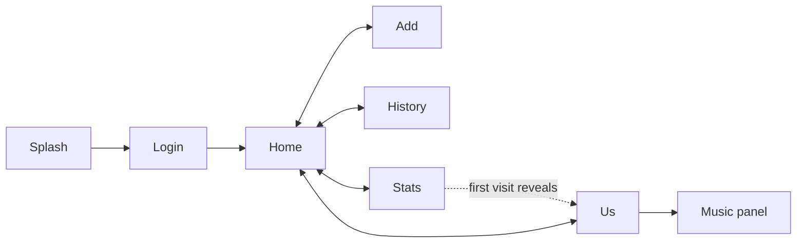

# UI / UX BIBLE

> Every screen and every modal: its purpose, the user's journey, components, interactions,
> and its loading / empty / error / edge-case behaviour. Verified against `index.html` and the
> JS that drives each surface.

Related: [DESIGN_SYSTEM](./DESIGN_SYSTEM.md) · [COMPONENT_LIBRARY](./COMPONENT_LIBRARY.md) · [ANIMATION_BIBLE](./ANIMATION_BIBLE.md) · [MEDIA_SYSTEM](./MEDIA_SYSTEM.md)

---

## Navigation model

Five tabs (`home`, `add`, `history`, `stats`, `us`) via the bottom nav. The **Us tab stays
hidden until the first visit to Stats** (`revealUsTab`, `js/us-tab.js:171`), making it feel
"discovered." The back button closes the top overlay or returns to Home (`closeTopOverlay`).

---

## SCREENS

### Splash (`#splash-screen`, `index.html:28-52`)
- **Purpose:** set an intimate, cinematic mood before the app appears.
- **Journey:** 10-second five-stage animation (see [ANIMATION_BIBLE](./ANIMATION_BIBLE.md#2-splash-screen-the-10-second-cinematic-sequence)) → reveals login. **Triple-tap within 700ms skips** it (`_handleSplashTap`, `js/app.js:50`).
- **Edge cases:** if JS is slow, the 9.4s timeout still starts the app; skip path uses faster exit timings.
- **States:** no loading/empty/error — purely presentational.

### Login (`#login-screen`, `index.html:54-103`)
- **Purpose:** identify which of the two people is using the app.
- **First-time form** (`#first-login-form`): user id (`imsusu`/`imgugu`) + 4-digit PIN.
- **Returning form** (`#returning-login-form`): shows the remembered name + a **custom numeric
  keypad** with PIN dots; a "switch user" key clears the saved id.
- **Journey:** valid PIN → `handleLogin()` (`js/auth.js:24`) saves the id to localStorage, inits
  Firebase, loads the profile, updates dynamic name labels, hides login, loads data.
- **Error state:** wrong PIN shakes the PIN dots (`.pin-dots.shake`) / shows an error; no lockout
  (acceptable for two trusted users).
- **Edge cases:** PINs are client-side (`js/config.js`) — intentional; see [SECURITY_REVIEW](./SECURITY_REVIEW.md).

### Home tab (`#home-tab`)
- **Purpose:** the financial "at a glance."
- **Components:** balance card (amount + who-pays icon), budget progress card, settle button,
  recent expenses (5). Rendered by `renderBalance`, `updateBudgetProgress`, `renderRecentExpenses`.
- **Empty state:** "No expenses yet" with 💸 icon (`js/expenses.js:387`).
- **Celebration:** when the balance reaches ₹0, `#balance-celebration` shows for 3s with floating
  hearts (`showBalanceCelebration` `js/ui.js:52`, `showFloatingHearts` `js/expenses.js:363`).

### Add tab (`#add-tab`)
- **Purpose:** record a shared expense.
- **Fields:** amount; paid-by (me/partner); split (equal/custom → reveals `#custom-split`);
  category (7 chips); note; date (defaults today); "count towards budget" (checked by default).
- **Journey:** `handleExpenseSubmit()` (`js/expenses.js:30`) validates amount > 0, computes
  `shares`, writes to Firestore, emits `expense:created`, reloads, success toast.
- **Edge cases:** double-submit guarded by `isSubmitting`; labels reflect the logged-in user's name.

### History tab (`#history-tab`)
- **Purpose:** browse/search all expenses.
- **Controls:** debounced search (`#expense-search`, 200ms via `debounce`), paid-by filter,
  month filter (populated from data). Results via `renderAllExpenses()` with edit/delete actions.
- **Empty state:** filtered-empty shows a gentle message; rows animate in (`fadeInUp` stagger).

### Stats tab (`#stats-tab`)
- **Purpose:** calm monthly spending insight (not "analytics").
- **Components:** total + each person's contribution (named), SVG pie chart, category breakdown,
  6-month trend bars. Rendered by `renderStats()` (`js/stats.js:5`).
- **Side effect:** first visit **reveals the Us tab**.
- **Edge cases:** all computed client-side from the in-memory `expenses` array for the current month.

### Us tab (`#us-tab`) — the emotional heart
- **Purpose:** the shared, warm, living space. Light theme (late-night variant after 23:00).
- **Components (top→bottom):** header (title, subtitle, day counter, partner "last seen"),
  ritual daily-quote card, mood tracker, milestones, moments preview, memory highlight
  ("on this day"), daily reminder, **memories timeline**, sticky notes, secret notes,
  late-night message, easter egg.
- **Ambient:** breathing gradient, twinkling stars, floating hearts/particles, soft music
  autoplay after 12s (or resume if already playing).
- **Hidden/conditional surfaces:** `#memory-highlight` (anniversary memory), `#daily-reminder`
  ("haven't captured today"), `#late-night-message` ("Good night, us."), `#easter-egg`
  ("You're my person 💝" via 2s long-press on the title).
- **Empty states:** memories/notes/secret-notes/moments each have warm empty copy.

---

## MODALS & OVERLAYS

Registered in `MODAL_IDS` (`js/app.js:127-138`) so the back button manages them. All open with
`animateModalIn` and close via close-button, backdrop click, or back button.

| Modal | id | Purpose | Open / submit |
|-------|----|---------|---------------|
| Settle-up | `#settle-modal` | Clear the balance to ₹0 | `showSettleModal` / `handleSettle` (`expenses.js:249/272`) |
| Edit expense | `#edit-expense-modal` | Modify an expense | `showEditExpense` / `handleExpenseEdit` (`expenses.js:198/132`) |
| Budget | `#budget-modal` | Set/edit monthly budget | `handleBudgetSubmit` (`budget.js:82`) |
| Memory | `#memory-modal` | Upload photos/videos/audio + caption + date | `handlePhotoSelect` / `handleMemoryUpload` (`memories.js:33/294`) |
| Album viewer | `#album-viewer-modal` | Swipe through a multi-photo memory | `viewAlbum` (`memories.js:624`); swipe `setupAlbumSwipe:670` |
| Photo viewer | `#photo-viewer-modal` | Full-screen single memory | `viewSinglePhoto` (`memories.js:594`) |
| Image adjust | `.image-adjust-modal` (dynamic) | Reposition/zoom an image (sliders + Hammer pan) | `startImageAdjust`/`saveImagePosition` (`memories.js:465/560`) |
| Note | `#note-modal` | Add a sticky note | `handleNoteSubmit` (`notes.js:17`) |
| Secret note | `#secret-note-modal` | Create a time-locked message | `handleSecretNoteSubmit` (`notes.js:164`) |
| Moments | `#moments-modal` | Full calendar of moments (upcoming/past) | `openMomentsFullView` (`moments.js:189`) |
| Moment form | `#moment-form-modal` | Create/edit a moment | `openCreateMoment`/`handleMomentFormSubmit` (`moments.js:265/300`) |
| Music panel | `#music-player-panel` | Playlist, playback, recently played | `toggleMusicPlayer` (`music.js:152`) |
| Balance celebration | `#balance-celebration` | ₹0 celebration overlay (3s) | `showBalanceCelebration` (`ui.js:52`) |

### Notable interaction details
- **Album swipe:** ≥50px horizontal swipe → prev/next (`navigateAlbum`, wraps around).
- **Image adjust:** sliders for X/Y/zoom plus drag (Hammer pan); the `touchmove` inside this modal
  is intentionally non-passive to stop background scroll while dragging — the one sanctioned
  exception (see [PROJECT_BIBLE §9](./PROJECT_BIBLE.md#9-rules-future-developers-and-ais-must-follow)).
- **Secret notes:** locked cards show a countdown to `unlockDate`; unlocked cards reveal content.
- **Music autoplay:** entering the Us tab schedules a 12s fade-in autoplay unless already playing;
  leaving pauses and remembers state (`musicWasPlaying`).

---

## Global UI states

- **Loading:** `#loading` spinner via `showLoading(show)` — **suppressed while on the Us tab** to
  protect its calm/scroll (`js/ui.js:5`).
- **Toasts:** `showError` (red, 3s) / `showSuccess` (green, 2s).
- **Empty states:** every list has gentle, inviting copy (verified in expenses/memories/notes/
  secret-notes/moments render functions).
- **Confirms:** deletes (expense, note, memory, moment) confirm before acting.

## Accessibility notes (current state)
- Semantic-ish HTML with `alt` text on icons; tactile feedback on all controls.
- **Gaps (tracked in [KNOWN_LIMITATIONS](./KNOWN_LIMITATIONS.md)):** zoom disabled
  (`user-scalable=no`); no `prefers-reduced-motion`; some controls are emoji/icon `<button>`s
  that would benefit from `aria-label`; colour-contrast on the light Us theme should be spot-checked.
  These are improvement opportunities, not regressions — keep the warmth while addressing them.

---

### Related documents
[COMPONENT_LIBRARY](./COMPONENT_LIBRARY.md) · [MEDIA_SYSTEM](./MEDIA_SYSTEM.md) · [STATE_MANAGEMENT](./STATE_MANAGEMENT.md) · [ANIMATION_BIBLE](./ANIMATION_BIBLE.md)
